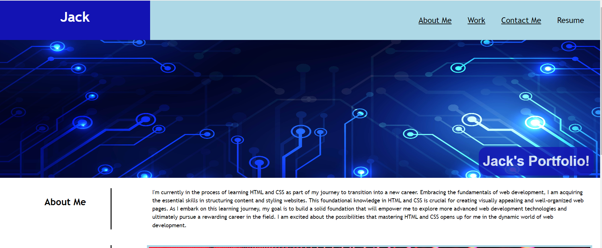

# project-showcase

## Description ##

For this project my goal was to create a landing page to showcase my portfolio to show to potential employers in the future. It shows a small section about me and then links to my projects. As of now, only the first image link in the grid will take you to a project I have completed,but more will be added as I progress through the course. 

The content shows what I have learnt so far in the course by using flex boxes, semantic HTML, media query as well as variables. 

https://jemmonds.github.io/project-showcase/

